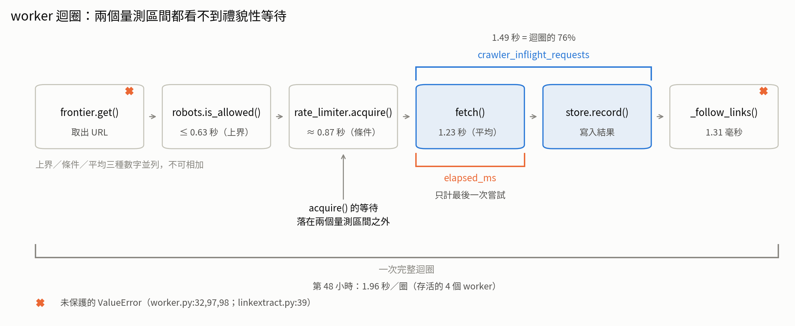
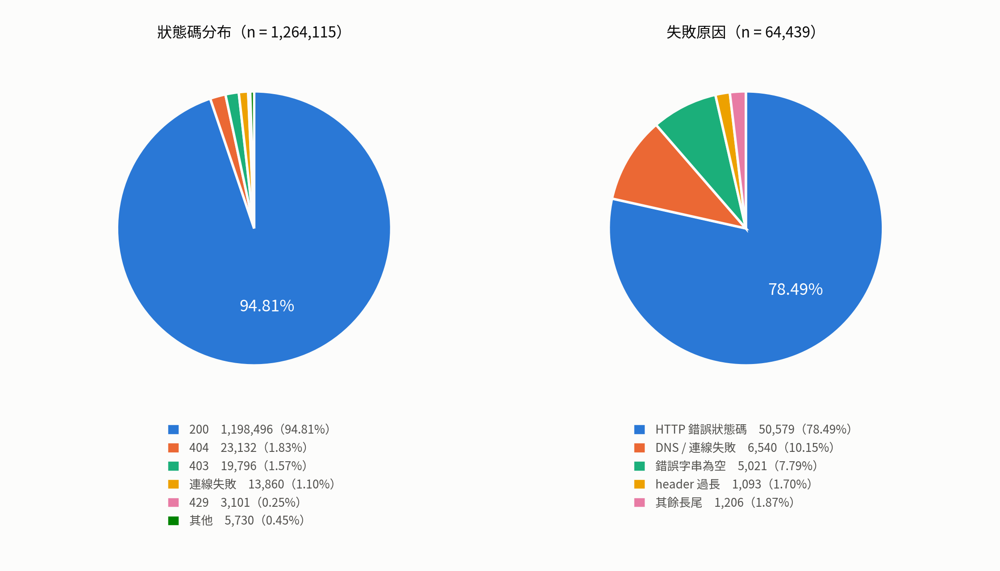
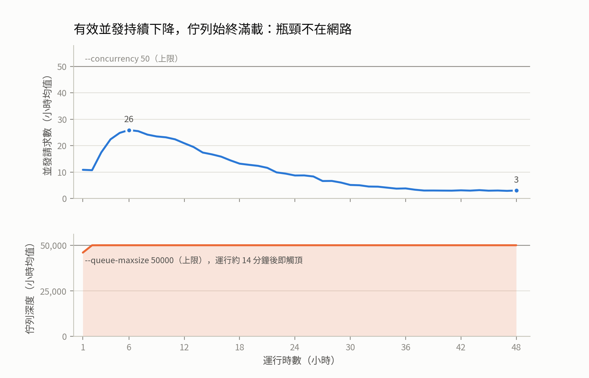
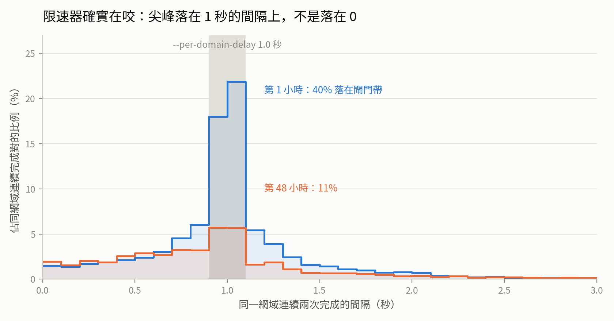

# CSIE5377 Starter Project

## 單機非同步爬蟲，無人值守連續運行 48 小時

**黃柏維 Po-Wei Huang** ｜ 學號 r14922144

2026-09-20 · NTU CSIE5377

<!--
文件索引在 docs/README.md，完整內容是 docs/01-system-design.md 與
docs/02-48h-run-results.md。被問細節時報檔名就好，不必唸路徑。
-->

---

## 48 小時完成 126 萬次抓取，吞吐量卻衰減 9.2 倍

| | |
|---|---|
| **1,264,115** | 次 HTTP 抓取，其中 **1,199,676** 次成功（94.90%） |
| **18.8 → 2.0** | 次/秒：第 5 小時高峰到視窗結束，48 小時內衰減 **9.2 倍** |
| **172,800 秒** | 連續無人值守；種子 **1,000** 個網址，由樞紐頁面加 Tranco 排名分層抽樣產生 |

<!--
標題數字避開 7.32 次/秒 是有理由的：那是 1,264,115 ÷ 172,800，是健康階段與
瀕死階段的混合平均，當成穩態值會得到與本次發現完全相反的結論。要講速率就講區間，
18.8 → 2.0。

「成功」的判定是 FetchResult.ok，即
error is None and status is not None and status < 400（fetcher.py:34-35）；
網域一律取 urlparse(url).netloc。那個 status is not None 的守衛不能省：
13,860 筆重試耗盡的紀錄 status 就是 null。

全片的吞吐量數字一律取自 results/throughput-hourly.csv（第 5 小時 67,614 次、
第 48 小時 7,354 次）。對同一份 jsonl 重新分桶會得到 67,680 與 7,354，
差在小時邊界的歸屬；我一律引用 committed 的 CSV，因為那是聽眾可以自己查的檔案。

1,264,115 與 1,199,676 取自 results/summary-48h.json。網域數字（觸及 174,973、
至少成功回應過一次 138,898）與被 robots.txt 擋下的 23,179 筆在附錄的收斂表裡，
被問到再翻。

種子如何選的通常是第一個被問的問題：樞紐頁面（各領域的入口與目錄頁）加上
Tranco 排名的分層抽樣，見 scripts/generate_seeds.py。
-->

---

## worker 迴圈有六步，量測區間只蓋住其中兩步



- 禮貌性是兩層閘門（每網域併發 2、間隔 1.0 秒），而量測區間排在它之後：`INFLIGHT.inc()` 在 `acquire()` 之後（`worker.py:48-49`），等待完全不計入

<!--
圖上要指三件事：
一、crawler_inflight_requests 只括住 fetch() 與 store.record()，因為 INFLIGHT.inc()
排在 rate_limiter.acquire() 之後（worker.py:48-49）。
二、elapsed_ms 括得更窄，只有 fetch()，而且只記最後一次嘗試。
三、get() 與 _follow_links() 裡有沒被 try 包住的呼叫，那是第六頁的伏筆。

這支爬蟲確實是 I/O bound，而這句話在這裡有量測撐著：
_follow_links() 每頁 1.31 毫秒（本機重現量測），第 48 小時只佔 event loop 的 0.27%；
同一時期存活 worker 有 76% 的時間待在 fetch() 與 record() 之內。CPU 從來不是瓶頸。

frontier 上限 5 萬、滿了就丟，48 小時丟掉 65,355,760 條連結，約佔發現量 98%。
丟掉九成八這件事自己先認：它證明 frontier 從不缺工作，但也說明覆蓋範圍是到達
順序的產物——排程就是 FIFO 廣度優先，沒有優先級。細節在附錄的入列語意那頁。

各區段的實測成本與它們各自是哪一種數（上界、條件平均、真平均）見附錄，
不要在這裡把它們加起來。
-->

---

## 94.90% 的請求成功；延遲中位數 868.5 ms 是聚合值，逐小時一路上升


- 以 1,264,115 次抓取為分母：200 佔 94.81%、404 佔 1.83%、403 佔 1.57%、無狀態碼（重試耗盡）佔 1.10%、429 佔 0.25%
- 成功抓取有 83.9% 在 2 秒內；逐小時 p50 由第 1 小時的 528.5 ms 升到第 36 小時的 1,181.8 ms

<!--
CDF 的母體是 1,199,676 筆成功抓取：中位數 868.5 ms，83.9% 在 2 秒內，
p99 = 6,019 ms，最大 14,381 ms。

逐小時的 p50：第 1 小時 528.5 ms、第 36 小時 1,181.8 ms（峰值）、第 48 小時
941.9 ms。配對網域的對照在第七頁的表裡。

64,439 次失敗的組成：HTTP 錯誤狀態碼 50,579、DNS 或連線失敗 6,540、錯誤字串為空
5,021、header 過長 1,093，其餘長尾合計 1,206。近八成是目標站台自己回的狀態碼，
本地連線問題只佔一成出頭，所以問題出在目標站台那一端，不在爬蟲本身。
圓餅圖在附錄。

「無狀態碼」那 13,860 筆是 status 為 null 的紀錄，全部走 fetcher.py:103 的重試
耗盡路徑，elapsed_ms 都是 0，不列入延遲母體。那個 0 是回傳 FetchResult 時沒帶
elapsed=、落回 dataclass 預設值 0.0（fetcher.py:29）造成的；在 max_retries=3、
timeout=10.0、backoff_base=0.5 之下，單筆最壞可以耗掉 45.0 秒。
-->

---

## 吞吐量在 48 小時內衰減 9.2 倍，過程平滑、沒有懸崖


- 高峰在第 5 小時 67,614 次（18.78 次/秒），第 48 小時 7,354 次（2.04 次/秒）；中間有 12 次小幅回升（如第 46 到 47 小時 6,721 → 7,422），但從未出現斷崖

<!--
這一頁的重點是排除法：連續而平滑，所以不是某次當掉，也不是某個網域卡住。
但不要說「單調」——48 小時內有 12 次小時對小時的回升，圖上看得到。

會被問到的是另一個缺口：18.8 → 2.0 講得很細，46 → 18.8 卻一直沒講。即使在高峰
也只跑到理論值的 41%——50 個 worker、平均延遲 1.085 秒，上限應是 50 ÷ 1.085 =
46.1 次/秒。答案在附錄的迴圈拆解裡：第 5 小時只有 49.73% 的迴圈落在量測區間
之內，另外一半花在 acquire()、robots 與 _follow_links()。

峰值 18.78 次/秒 對應 67,614 ÷ 3600。
-->

---

## 主因是有效併發從 50 塌到 4


- **已量測**：第 48 小時 718 次 inflight 取樣全部落在 0–4，一次都沒有到 5。Binomial(4, 0.76) 逐格吻合；若仍有 50 個 worker，應有 134 次超過 4，實測 0 次
- **推論，未直接觀測**：worker 是死掉，而非永久卡在 `INFLIGHT.inc()` 之前。卡在量測區間之內會把 gauge 釘在高位，實測卻是低位；但究竟哪個例外觸發已不可考

<!--
量測與推論要分開講，講混了整段就不成立。

量測這一邊：crawler_inflight_requests 的 30 分鐘天花板先由 28 升到 43（第 2 到 3
小時），之後一路下滑到 4。下滑途中有 8 次小幅回升，但再也沒有回到早期水準；
第 37 小時之後的最後 11 小時，沒有任何一格超過 4。第 48 小時的 718 次取樣是
{0:1, 1:31, 2:144, 3:300, 4:242}，Binomial(4, 0.76) 預測 {2, 30, 143, 303, 240}。
同均值的 Binomial(50, 0.061) 預測 134 次超過 4，實測 0 次——圖上那條線畫成淡色，
因為它是被否定的模型。以二項分布最大概似估計的存活數：50 → 35（第 12 小時）
→ 12（第 24 小時）→ 5（第 36 小時）→ 4；指數存活曲線 R² 0.947，線性只有 0.876。

推論這一邊：資料能排除「卡在量測區間之內」的所有解釋——連線槽洩漏或 record()
的鎖會把 gauge 釘高，而實測是低位。剩下的是死掉，或永久卡在 INFLIGHT.inc() 之前。
死掉這一支證據強得多：worker() 只有 try/finally 沒有 except，main.py:128 用
return_exceptions=True 吞掉例外，而三個未防護的呼叫點都已在本機對真正的模組重現過
ValueError: Invalid IPv6 URL（linkextract.py:39 的 urljoin、worker.py:97 的
normalize_url、worker.py:32 與 :98 的 domain_of）。但哪個例外真的開火無法重建：
logging_config.py 只寫 stdout，這次運行沒有留下 log。

被追問死亡率的話：50 降到 4 是 46 次死亡，除以 1,264,115 次抓取等於每 27,481 次
抓取死一個。措辭要小心，這是從結論反推出來的合理性檢查，不是獨立證據；
它與獨立等風險的指數存活曲線一致，如此而已。

存活下來的 worker 反而更忙：每 1.96 秒完成一次迴圈，76% 的時間待在 fetch() 與
record() 之內，比高峰期的 49.73% 高。掉的是 worker 的數量。
-->

---

## 其餘假設都不足以解釋 9.2 倍

| 假設 | 判定 | 證據 |
|---|---|---|
| 每網域 1.0 秒間隔造成排隊 | 固定成本，與衰減無關 | 同網域連續請求時平均等待約 0.87 秒，但第 1 小時咬得更緊（長度 ≥2 的排空鏈平均 4.00 → 2.73） |
| 同一批伺服器變慢 | 確實發生，原因未證實 | 996 個在第 3–8 與第 40–48 小時都成功抓取過的網域，逐網域中位數 813 → 1,048 ms（1.29 倍）；太小，無法產生 9.2 倍 |

GC 停頓與 `write_checkpoint()` 停頓是本組先前書面結論的兩項撤回，量測之後都不成立；連同另外兩項已排除假設，詳見附錄。

<!--
撤回那一行自己先講，不要等人問：原本文件寫「可量測的停頓共 67 段、加總 841 秒、
單次最長 41 秒」，在任何門檻下都重現不出來，而且它引用的是完成紀錄的空窗，
那些空窗本身就是低吞吐量的結果，不是成因。原本文件也把 GC 停頓列為主要假設，
量測之後是錯的。兩者都寫在附錄的完整表格裡。

第二列的兩個視窗要講出口，否則聽眾無法自己重現：配對取的是第 3–8 小時與第 40–48
小時都有 ok 紀錄的網域，統計量是逐網域中位數再取中位數。若改成第 1 小時對第 48
小時，共同網域只剩 3 個，算不出東西。
-->

---

## 最該補的是一個 `except`，而下一步是把推論變成量測

- **`worker()` 補 `except Exception: logger.exception(...); continue`，再加一個 `WORKERS_ALIVE` gauge**：兩行程式碼。這次整場運行沒有任何指標在數存活 worker
- **這個實驗沒有做**：帶新 gauge 重跑幾小時，存活曲線就是直接畫出來的線，不必再靠二項分布擬合。沒做是因為時間不夠

<!--
排序不按效能收益，按「下次能不能看見問題」。第一項不會讓爬蟲變快，
但它會讓下一次的衰減在第 9 小時就被看見，不必等到事後對 inflight 直方圖
做二項分布擬合才察覺。

結論建立在二項分布推論上，這個缺口自己先說。把它變成直接觀測只需要重跑一次
加兩行程式碼，沒做的原因是時間，不是技術困難，講清楚比被問出來好。

其餘修正被問到再講：每網域 back queue、以網域為 key 的 dict 全改 LRU、
write_checkpoint() 走 asyncio.to_thread()、fetcher.py:103 補上 elapsed=。
back queue 同時解決 FIFO 廣度優先的問題——worker 直接從「下一個可以抓的網域」
取工作，覆蓋範圍就不再只是到達順序的產物。細節在附錄的入列語意那頁。
-->

---

# 附錄

以下投影片不在 8 分鐘的主線內，供提問時取用。

---

## 附錄：48 小時從 174,973 個網域收斂到 138,898 個

| 階段 | 網域數 | 與上一階段的差 |
|---|---|---|
| 曾進入 frontier | 174,973 | — |
| 被取出並寫下紀錄 | 165,730 | −9,243：收工時佇列仍是滿的，還沒輪到 |
| 實際發出 HTTP 請求 | 158,885 | −6,845：`robots.txt` 全數禁止 |
| **至少成功回應一次** | **138,898** | −19,987：連不上，或只拿到 4xx／5xx |
| 其中至少有一次 2xx | 138,852 | −46：成功紀錄全是 3xx |

<!--
簡報裡出現的三個網域數字在這裡一次講完，避免把「觸及」誤認為「抓取」。

174,973 是 gauge 的最終值，會被 --resume 整份還原（Frontier.from_snapshot，
frontier.py:207），因此不能當作視窗內的發現量。它有兩個方向的偏差：
向上偏——該跑次以 --resume 接續前一次中斷的爬取，繼承而來的網域數約
6,400 到 6,800，無法由 committed 資料精確重建（回推所用的 output/metrics_log.csv
原始檔不在版本控制內；committed 的 clean 檔第一筆取樣就已經是 6,829）。
向下偏——try_add() 在佇列滿時於 frontier.py:118-120 直接返回，那 65,355,760 條
被丟掉的連結從未進過這個 gauge。

表上的 −9,243 是「收工時仍在佇列裡、還沒輪到」的網域，與繼承數無關，
兩者不要混為一談。

若有人問 www. 是否重複計算：以 eTLD+1 估算約 7.6 萬個註冊網域，但那是手寫的近似
（環境裡沒有 public suffix list 套件），只能當旁註，不要當數字引用。
-->

---

## 附錄：64,439 次失敗的組成



<!--
64,439 次失敗的組成：HTTP 錯誤狀態碼 50,579、DNS 或連線失敗 6,540、錯誤字串為空
5,021、header 過長 1,093，其餘長尾合計 1,206（含連線重置 143 與伺服器斷線 93）。
50,579 ÷ 64,439 = 78.5%，這就是「近八成是目標站台自己回的狀態碼」的來源。

左圖的「其他」是 5,730 次，組成為：其餘 2xx 998 次、全部 3xx 182 次、
其餘 4xx／5xx 4,515 次，再加上兩個非標準狀態碼 999（30 次）與 901（5 次）共 35 次。
那 35 次既不是 4xx 也不是 5xx，所以前三項相加是 5,695，不是 5,730。
-->

---

## 附錄：第 48 小時的迴圈成本，三種不同性質的數字

| 區段 | 數值 | 這是哪一種數 |
|---|---|---|
| 整個迴圈 | 1.96 秒 | 真平均（存活 worker 數 ÷ λ） |
| 量測區間（`fetch()` ＋ `record()`） | 1.49 秒 | 真平均（L ÷ λ），佔迴圈 76% |
| 區間之外的全部時間 | 至多 0.47 秒 | 由上兩列相減得到的上界 |
| `robots.is_allowed()` | 至多 0.63 秒 | 上界（每次抓取 0.127 個新 origin × 5 秒逾時） |
| `rate_limiter.acquire()` | 約 0.87 秒 | 條件平均，僅限同網域連續請求時 |
| `_follow_links()` | 1.31 毫秒／頁 | 本機重現量測 |

**這六列不能相加**：0.63 與 0.47 是上界，0.87 是條件平均，只有 1.96 與 1.49 是迴圈的真平均。

<!--
0.87 秒本身就大於區間外可用的 0.47 秒，這不矛盾，因為它只在同網域連續請求時發生：
第 48 小時只有 13.8% 的同網域配對落在 1–2 秒的閘門區間。把 0.87 當成每次迴圈的
平均等待會直接與 1.96 秒的迴圈衝突，這一列的標籤就是為了擋住那個誤讀。

0.87 的推導：≤2 秒的同網域連續排空鏈，只取長度 ≥2 的鏈，平均長度 2.73，
(2.73−1)/2 ≈ 0.87 秒。把長度 1 的單筆也算進來，平均會掉到約 1.16，那是另一個數。

robots 那一列的 0.127 是第 48 小時每次非 robots 抓取新增的 origin 數，由
output/results_clean.jsonl 全量重算。用 origin 而不用網域，是因為 robots.py:32
就是以 scheme://netloc 當快取的 key；同一組資料改用 netloc 是 0.118。
-->

---

## 附錄：其餘四項已排除的假設

| 假設 | 判定 | 證據 |
|---|---|---|
| `_follow_links()` 塞住 event loop | 已量測排除 | 每頁 1.31 毫秒，累積狀態放大 22 倍後不變；第 48 小時佔 loop 的 0.27%（本機重現量測） |
| 無上限狀態造成 GC 停頓 | 已量測排除，**原為本組主要假設** | 單次 gen2 由 16.5 毫秒長到 702 毫秒，但 48 小時只觸發約 19 次、合計約 13 秒（本機重現量測） |
| `write_checkpoint()` 阻塞 event loop | 已量測排除，**原書面結論撤回** | 最終規模實測 0.736 秒，576 次合計 424 秒、佔 0.25%（本機重現量測）；取樣器全視窗最大空窗 9 秒 |
| frontier 枯竭、沒工作可做 | 已排除 | 佇列 90.4% 的取樣在 49,999 以上，累計丟棄 65,355,760 條連結 |

<!--
第二、三列是主動撤回。原本文件寫「可量測的停頓共 67 段、加總 841 秒、單次最長
41 秒，僅佔視窗時間約 0.5%」——這在任何門檻下都重現不出來（完成紀錄空窗
≥7 秒是 68 段 1,114.9 秒、≥10 秒是 39 段 884.7 秒、最大 46.0 秒），而且它是循環論證：
那些空窗就是低吞吐量本身。原本文件也把「無上限狀態造成 GC 停頓」列為尚未證實的
主要假設，量測之後是錯的。

所有標「本機重現量測」的數字都是事後在本機以真實模組重跑得到的，不是這次運行
本身記錄下來的資料，引用時要分清楚。
-->

---

## 附錄：九個模組，frontier 最重、其餘各守一個邊界

| 模組 | 職責 |
|---|---|
| `frontier.py` | 有界待爬佇列、網址正規化去重、每網域頁數統計、referrer 追蹤、checkpoint 快照 |
| `ratelimiter.py` | 每網域併發數上限與每網域最小請求間隔 |
| `robots.py` | robots.txt 快取（依 origin 快取，fail-open） |
| `fetcher.py` | 實際發出 HTTP 請求，指數退避加隨機抖動的重試 |
| `linkextract.py` | 以標準庫 `html.parser` 抽取頁面上的 `<a href>` |
| `checkpoint.py` | 週期性、原子化地把爬蟲狀態寫入磁碟 |
| `storage.py` | append-only JSON Lines 結果紀錄 |
| `worker.py` | 串接上述元件：抓取 → 記錄 →（選擇性）連結追蹤 |
| `main.py` | 進入點：啟動與關閉流程、訊號處理、CLI 參數 |

<!--
這是核心的九個；crawler/ 底下另有 config.py、metrics.py、logging_config.py、
stats.py、reporter.py 五個支援模組，簡報別處引用到的 logging_config.py 與
metrics.py 就在那一批裡。frontier.py 明顯偏重，真要再切會切成
「佇列 ＋ 去重」與「每網域配額 ＋ 快照」兩塊。
-->

---

## 附錄：禮貌性由兩個獨立控制構成

| 控制 | 參數 | 預設 |
|---|---|---|
| 每網域併發數上限 | `--per-domain-concurrency` | 2 |
| 同一網域兩次請求起始的最小間隔 | `--per-domain-delay` | 1.0 秒 |

- 只有全域上限 50 是不夠的：排程順序不巧時，50 個 worker 可能同時落在同一個小網站上
- `--max-pages-per-domain 20` 用**被發現連結自己的網域**判斷，不看來源頁面的網域；用來源頁面判斷會反過來切斷合法的跨網域發現
- robots.txt 每個 origin 只抓一次並快取整場運行，首次抓取由該 origin 專屬的 `asyncio.Lock` 保護；採 fail-open

<!--
第二層的存在理由：即使併發數是 1，連續的請求仍可能快到讓小型站台吃不消。
這是 Scrapy AutoThrottle 的簡化版本，差別在於它不會依觀測到的伺服器延遲動態調整。

fail-open 的取捨要說清楚：robots.txt 不存在、回應非 200、或抓取本身失敗時預設允許。
這是為了不讓一個暫時掛掉的 robots.txt 端點把整個 origin 變成黑洞。
-->

---

## 附錄：誰呼叫入列，決定它會不會阻塞

| 呼叫者 | 方法 | 佇列滿時 |
|---|---|---|
| 種子清單載入（`add_many()`） | `add()` | `await queue.put()` 等待空位 |
| 連結追蹤（`worker._follow_links()`） | `try_add()` | 立刻放棄該連結並計數 |

- 佇列上限 5 萬、滿了就丟，48 小時丟掉 65,355,760 條連結（約佔發現量 98%）：反壓有了，但排程就是 FIFO 廣度優先，沒有優先級

**連結追蹤的呼叫端本身就是那個數量有限的 worker pool 裡的一員，而佇列唯一的排空途徑是 worker 呼叫 `get()`；在已滿的有界佇列上做阻塞式入列，等於生產者在等一個就是自己的消費者。**

<!--
入列前先 normalize_url()，再以正規化後的網址查 _seen 去重。去重發生在入列時而非
抓取時，因此「在 _seen 裡」等價於「至多被入列過一次」，這個不變式讓 seen_count
成為單調遞增的進度指標。

被 try_add() 放棄的網址不會寫入 _seen，佇列之後有空間時仍有機會被重新發現；
放棄的語意是「這次不排程」，不是「永久排除」。丟棄數量由
crawler_links_dropped_queue_full_total 計數，48 小時累計 65,355,760 條。

tests/ 裡有一個回歸測試鎖住這個語意：讓每個 worker 各自處理連結數超過佇列容量的
頁面，斷言整場爬取仍然跑完。
-->

---

## 附錄：robots.txt 每 origin 抓一次、重試退避加抖動、取消永遠先拋

- 每個 origin 的 robots.txt 只抓一次並快取整場運行，首次抓取由該 origin 專屬的 `asyncio.Lock` 保護
- 採 fail-open：robots.txt 不存在、回應非 200、或抓取本身失敗時，預設允許抓取
- 重試等待為 `retry_backoff_base * 2 ** (n - 1)`，再加一段 `random.uniform(0, retry_backoff_base)` 的隨機抖動
- 抖動是為了讓退避後的重試不擠在同一瞬間重新打到同一台伺服器——最後一列的 14,342 筆 `attempts` 為 4，佔 18,615 筆重試紀錄的 77%，絕大多數重試是一路退到耗盡
- `--max-retries` 預設 3；取消（cancellation）一律在任何寬泛的 `except` 之前重新拋出
- 實測 attempts 分布：1 次 1,245,500、2 次 3,202、3 次 1,071、4 次 14,342

<!--
Σ(attempts − 1) = 48,370，這是由上面那份分布算出來的，不是引用 Prometheus 計數器
（metrics_log_clean.csv 裡的 crawler_retries_total 讀到 48,374，相差 4 筆，
應為視窗切邊造成）。

max_retries=3、request_timeout=10.0、backoff_base=0.5 允許的最壞情況是單筆紀錄
耗掉 45.0 秒的 worker 時間：4 次逾時 40 秒，加上三段退避的上限 1.0 + 1.5 + 2.5 秒。
抖動取期望值的話是 44.25 秒。而重試耗盡者的 elapsed_ms 被寫成 0，這段時間在
任何延遲統計裡都看不到。
-->

---

## 附錄：一筆紀錄十個欄位，`robots_blocked` 是唯一的守規證明

```json
{"url": "https://www.example.edu/", "domain": "www.example.edu",
 "status": 200, "ok": true, "elapsed_ms": 51.3, "attempts": 1,
 "error": null, "robots_blocked": false, "ts": 1789577372.7314777,
 "referrer": null}
```

`robots_blocked` 為 `true` 的紀錄同樣會寫出（`status` 為 `null`、`elapsed_ms` 與 `attempts` 為 0）。

<!--
這個 specimen 直接照 storage.py:50-62 的寫法排：ts 是 time.time() 的裸 epoch
浮點數（storage.py:59），不是 ISO 8601 字串；上面那個 1789577372.7314777 就是
視窗第一筆紀錄的真實 ts。error 由 storage.py:57 無條件寫入，所以它一定在。

referrer 是唯一會整個 key 消失的欄位：include_referrer 為假時它不出現，
而不是寫成 null。固定清單模式下沒有 referrer 這個概念，輸出結構就不該多一個
永遠沒人填的欄位；開啟連結追蹤後它存在，種子本身的值仍是 null。

注意 elapsed_ms 為 0 有兩種來源：robots 擋下（真的沒發請求），以及重試耗盡
（fetcher.py:103 沒帶 elapsed=，落回預設 0.0）。後者是假的 0，共 13,860 筆。
-->

---

## 附錄：到點停止與使用者中斷走同一條收尾路徑

- `--max-runtime-hours 48` 由背景 coroutine 去 `set()` 那個 SIGINT 與 SIGTERM 同樣會設定的 `stop_event`，因此只有一套 teardown
- `--checkpoint-interval 300` 決定落地頻率；內容是 `seen`、`pending`、`domain_page_counts` 加上累計統計
- 寫入先進同目錄暫存檔，再以 `os.replace()` 覆蓋；即使在 write 與 replace 之間被 `kill -9`，也不會留下半截檔案
- `--resume` 直接重建 frontier 與統計計數器，跳過載入種子清單

<!--
pending 除了佇列當前內容，還包含 add() 已經寫入 _seen、但 await queue.put() 尚未
完成的網址；少了這一塊，卡在該空窗期的網址會既不在佇列裡也不在快照裡。

48 小時視窗這一跑就是以 --resume 接續前一次中斷的爬取，這是 distinct_domains
gauge 會帶著繼承值起跑的原因。
-->

---

## 附錄：三層可觀測性，沒有一層在數 worker

| 層 | 受眾 | 介面 |
|---|---|---|
| 結構化 log | log pipeline、`grep` 與 `jq` | JSON Lines 輸出到 stdout，一個事件一個物件 |
| 終端機狀態列 | 盯著 tmux pane 的人 | `--status-interval` 秒印一行人類可讀摘要 |
| Prometheus 指標 | 儀表板與腳本輪詢 | `:9090/metrics`，10 個 collector，由 `scripts/watch_metrics.py` 即時取樣 |

<!--
指標明確對應 SRE 四個黃金訊號：延遲 crawler_fetch_latency_seconds、流量
crawler_requests_total、錯誤 crawler_errors_total、飽和度 crawler_inflight_requests
相對於 --concurrency 與 crawler_queue_depth 相對於 --queue-maxsize。

這一層的盲點正是主線的結論：十個 collector 沒有任何一個在數還活著的 worker。
而且 log 只寫 stdout，這次運行沒有保留，所以殺死 worker 的例外無法回溯。
-->

---

## 附錄：測試完全不使用 mock

- 整個 `tests/` 目錄沒有任何 `unittest.mock`、`monkeypatch` 或 `patch()`
- 會發網路請求的邏輯一律以 `aiohttp.test_utils.TestServer` 啟動真正監聽本機連接埠的伺服器驗證，真的走一次 TCP 與 HTTP
- 續跑測試用 `subprocess.Popen` 啟動真正的 process 再 `.kill()`（等同 SIGKILL），然後斷言兩次抓取的網址完全不重疊、且聯集涵蓋全部網址
- 一個回歸測試讓每個 worker 各自處理連結數超過佇列容量的頁面，斷言整場爬取仍然跑完，鎖住非阻塞入列語意

---

## 附錄：技術棧

| 類別 | 技術／套件 | 用途 |
|---|---|---|
| 語言／執行環境 | Python 3.13 | 主要開發語言 |
| 併發模型 | `asyncio`（標準庫） | 單執行緒非同步併發 |
| HTTP client | `aiohttp` | 非同步 HTTP 請求；測試用本地伺服器（`aiohttp.test_utils`） |
| 連結解析 | `html.parser`（標準庫） | 抽取 `<a href>`，不引入第三方 HTML 解析套件 |
| robots.txt 解析 | `urllib.robotparser`（標準庫） | robots.txt 規則解析 |
| 可觀測性 | `prometheus_client` | 曝露 Counter、Gauge 與 Histogram 指標 |
| 資料持久化 | JSON / JSON Lines（標準庫） | 結果紀錄、checkpoint 與 log 格式 |
| 測試框架 | `pytest` + `pytest-asyncio` | 單元測試與整合測試，含真實子行程加 SIGKILL 測試 |

---

## 附錄：Little's law 的完整數字

| | 第 1 小時 | 第 5 小時（高峰） | 第 24 小時 | 第 48 小時 | 全視窗 |
|---|---|---|---|---|---|
| λ（次/秒） | 9.1714 | 18.7817 | 5.5467 | 2.0428 | 7.3155 |
| L＝平均 inflight | 10.8818 | 24.8647 | 8.7340 | 3.0460 | 10.7954 |
| W＝平均延遲（秒，`ok`） | 0.8324 | 1.0854 | 1.2256 | 1.2276 | 1.1927 |
| p50 延遲（秒，`ok`） | 0.5285 | 0.7661 | 0.9080 | 0.9419 | 0.8685 |
| λW ÷ L | 0.702 | 0.820 | 0.778 | 0.823 | **0.808** |
| 存活 worker 數 | 50 | 50 | 12 | 4 | — |
| 每次迴圈（秒） | 5.45 | 2.66 | 2.16 | 1.96 | — |
| 迴圈中落在量測區間的比例 | 21.76% | 49.73% | 72.78% | 76.15% | — |

<!--
這張表每一格都由同欄的上幾格除得出來。λW ÷ L 用的是表上印出來的四位
數字，不是另一份更精確的底稿，所以聽眾拿計算機按得出同樣的值。最後一列同理，
它就是 L ÷ 存活 worker 數。

48 個逐小時 λW ÷ L 的平均是 0.813 ± 0.035，那是另一個統計量，不要和全視窗那一格
混用（前一版簡報把 0.813 放在那一格，讀者自己相除會得到 0.808，看起來像算錯）。

λ 的定義是非 robots 紀錄除以 3600，對應 REQUESTS_TOTAL——被 robots 擋下的網址在
worker.py:46 就 continue 了，從未進過 gauge。逐小時的 λ 由
results/throughput-hourly.csv 算出，L 與存活 worker 數由 results/workers-hourly.csv。

λW/L 一致地是 0.81 上下而非 1，若沿用 p50 更只有 0.59。這是 INFLIGHT.inc() 的
擺放位置造成的系統性量測落差：acquire() 的等待排在區間之外，而 store.record()
被算在區間之內；再加上 elapsed_ms 對重試耗盡者直接寫 0。缺口穩定在每次抓取
0.28 秒，且在 λ 由 18.8 降到 2.0 的過程中幾乎不變。
-->

---

## 附錄：佇列永遠是滿的，在飛的請求卻愈來愈少



<!--
上下兩張分開畫、不共用 y 軸：0–50 與 0–50,000 疊在同一張圖上會憑空造出一個
不存在的相關性。重點是兩者的對比：可派工的網址從不匱乏，瓶頸在 worker 自己。

佇列在開始約 14 分鐘後就觸及 --queue-maxsize 50000，視窗內 90.4% 的取樣維持在
49,999 以上。
-->

---

## 附錄：每網域 1 秒間隔在這次運行裡確實生效



<!--
這是 --per-domain-delay 唯一的直接證據：同網域連續完成的間隔在 0.9–1.1 秒有
明顯尖峰。落在 0.9–1.1 秒這兩格的同網域配對，第 1 小時佔 39.9%、第 48 小時佔 11.4%。

另外算一個不同的區間 1–2 秒：第 1 小時 40.2%、第 48 小時 13.8%。它不是 0.9–1.1
的放大版——它丟掉了 900 毫秒那一格，又補進 1,100 到 1,900 毫秒那九格，
所以 40.2% 才會只比 39.9% 高一點點。

不要拿這張圖去論證衰減：閘門咬得最緊的時候正是吞吐量最高的時候，它是固定成本。
≤2 秒的同網域連續排空鏈（只取長度 ≥2 的鏈）平均長度由 4.00 降到 2.73，
對應同網域連續請求時的 acquire() 平均等待約 0.87 秒。
-->

---

## 附錄：已知限制與資料限制

- **記憶體中的狀態沒有上限，也沒有淘汰機制**：`_seen`、referrer 對應表、`RobotsCache` 中的 `RobotFileParser` 物件，以及 `ratelimiter.py` 裡三個以網域為 key 的 dict，全部只增不減。單次 gen2 GC 停頓因此從 16.5 毫秒長到 702 毫秒（本機重現量測）；實測它不是吞吐量衰減的主因，但這個成長本身仍是缺陷
- **`write_checkpoint()` 是同步的，會阻塞 event loop**：在 event loop 執行緒上把整個 `_seen` 序列化成 JSON，最終規模下實測 0.736 秒，48 小時累計 424 秒（本機重現量測）
- **`worker()` 沒有 `except`，例外會讓 worker 永久消失**：`main.py:128` 的 `return_exceptions=True` 會吞掉它，而沒有任何指標在數存活 worker
- **殺死 worker 的例外無法回溯**：`logging_config.py` 只寫 stdout，這次運行沒有保留 log，所以「哪一個例外開火」永遠無法從這批資料證實
- **「觸及網域」與「實際發出請求的網域」不是同一件事**：兩者相差 6,845 個，那是只被 `robots.txt` 擋下、從未真正發出請求的網域
- **`crawler_distinct_domains_total` 是 gauge**：該跑次以 `--resume` 起始，繼承而來的網域數約 6,400–6,800，無法由 committed 資料精確重建；同時它也不含因佇列已滿而被丟棄的 65,355,760 條連結
