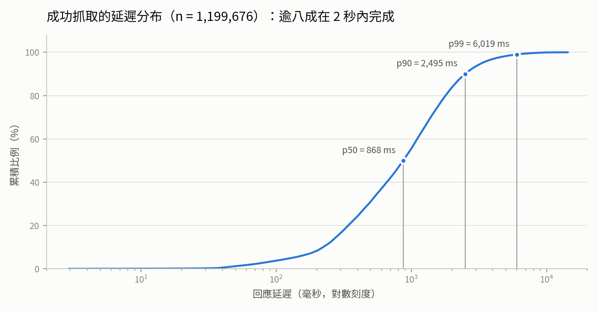
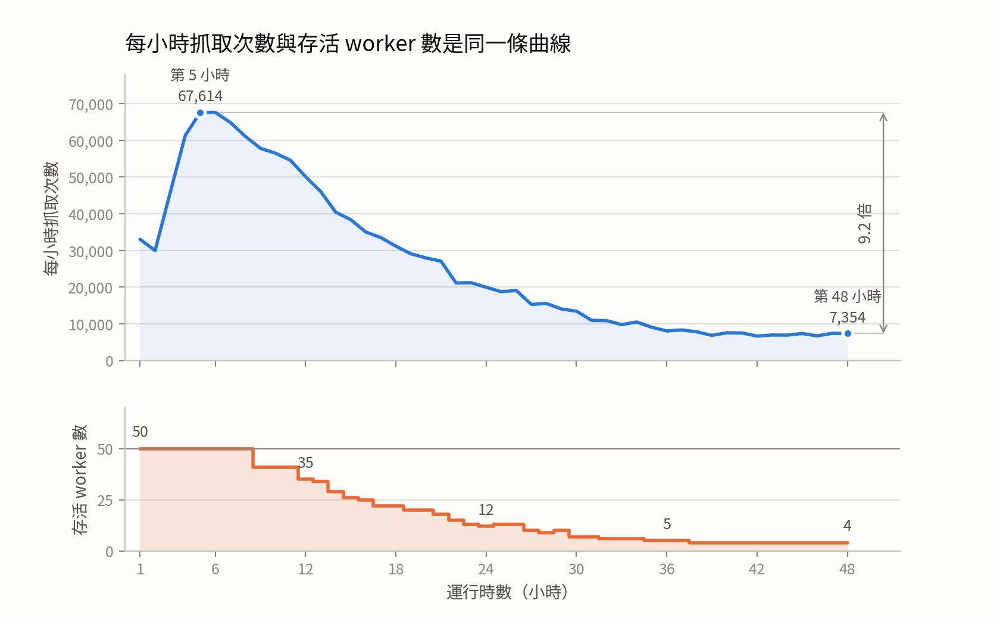
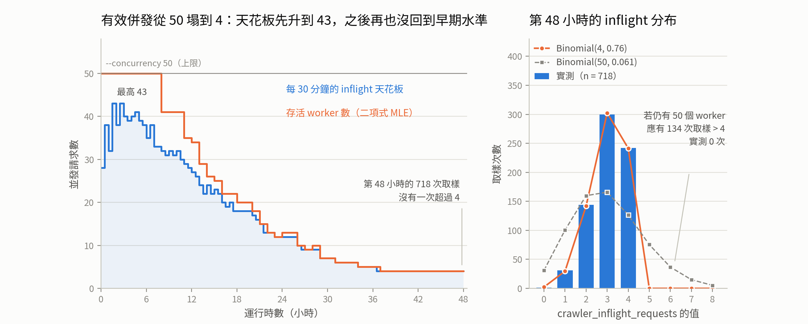

# CSIE5377 Starter Project

## 單機非同步爬蟲，無人值守連續運行 48 小時

**黃柏維 Po-Wei Huang** ｜ 學號 r14922144

2026-09-20 · NTU CSIE5377

<!--
文件索引在 docs/README.md，完整內容是 docs/01-system-design.md 與
docs/02-48h-run-results.md。被問細節時報檔名就好，不必唸路徑。
-->

---

## 每抓一頁就發現約 55 條可入列的新連結，最後只跑得動 1.9%

| | |
|---|---|
| **1,264,115** | crawled URLs：實際發出的 HTTP 請求，其中 **1,199,676** 次成功（94.90%） |
| **66,643,054** | discovered link **events**：通過每網域上限與去重後的連結發現次數 |
| **1.90%** | 兩者之比；98.07% 的發現在 `try_add()` 因佇列已滿被丟棄 |
| **48 小時** | 無人值守；種子 **1,000** 個網址，樞紐頁面加 Tranco 分層抽樣 |

`--queue-maxsize 50000` 在運行第 14 分鐘就填滿，之後「能入列的量」就等於「能抓完的量」。

<!--
兩個指標的定義要自己先講，否則第一個問題一定是「discovered 有沒有去重」。

66,643,054 是「發現事件」，不是不重複網址數。try_add() 先查 _seen 再入列
（frontier.py:112-119），佇列滿時直接丟棄且不寫入 _seen，所以同一個網址之後
再被發現會再計一次。不重複的已發現網址數落在 1,287,294 與 66,643,054 之間，
無法由本次輸出重建——被丟掉的網址沒有留下任何紀錄。

這個數字有兩個方向的偏差，兩邊都要認：
向上偏——重複發現被重複計數。
向下偏——連結的網域若已達 --max-pages-per-domain 20，在 worker.py:99 就被跳過，
根本沒進到計數器，所以真正抽出來的 <a href> 比 6,664 萬更多。

1.9% 不是缺陷，是有界 frontier 的必然：每抓一頁平均發現 54.5 條可入列的新連結
（65,355,760 ÷ 1,199,676），佇列滿之後入列速率被抓取速率綁死，比例就約等於
1 ÷ 54.5。跑多久都一樣——量到的不是覆蓋率，是分支因子的倒數。要提高只有兩條路：
放大佇列，或給 frontier 排優先級，這支實作兩者都沒有。

分母若改用 1,287,294（含被 robots.txt 擋下的 23,179 筆）則是 1.93%，
差別不影響結論，投影片取實際發出請求的 1,264,115。

標題數字避開 7.32 次/秒 是有理由的：那是 1,264,115 ÷ 172,800，是健康階段與
瀕死階段的混合平均，當成穩態值會得到與本次發現完全相反的結論。要講速率就講區間，
18.8 → 2.0。

「成功」的判定是 FetchResult.ok，即
error is None and status is not None and status < 400（fetcher.py:34-35）；
網域一律取 urlparse(url).netloc。那個 status is not None 的守衛不能省：
13,860 筆重試耗盡的紀錄 status 就是 null。

全片的吞吐量數字一律取自 results/throughput-hourly.csv（第 5 小時 67,614 次、
第 48 小時 7,354 次）。對同一份 jsonl 重新分桶會得到 67,680 與 7,354，
差在小時邊界的歸屬；我一律引用 committed 的 CSV，因為那是聽眾可以自己查的檔案。

1,264,115 與 1,199,676 取自 results/summary-48h.json。網域數字（觸及 174,973、
至少成功回應過一次 138,898）與被 robots.txt 擋下的 23,179 筆在附錄的收斂表裡，
被問到再翻。

種子如何選的通常是第一個被問的問題：樞紐頁面（各領域的入口與目錄頁）加上
Tranco 排名的分層抽樣，見 scripts/generate_seeds.py。
-->

---

## 94.90% 的請求成功；延遲中位數 868.5 ms

- 以 1,264,115 次抓取為分母：200 佔 94.81%、404 佔 1.83%、403 佔 1.57%、無狀態碼（重試耗盡）佔 1.10%、429 佔 0.25%
- 成功抓取有 83.9% 在 2 秒內；逐小時 p50 由第 1 小時的 528.5 ms 升到第 36 小時的 1,181.8 ms

<!--
CDF 的母體是 1,199,676 筆成功抓取：中位數 868.5 ms，83.9% 在 2 秒內，
p99 = 6,019 ms，最大 14,381 ms。

逐小時的 p50：第 1 小時 528.5 ms、第 36 小時 1,181.8 ms（峰值）、第 48 小時
941.9 ms。配對網域的對照在第七頁的表裡。

64,439 次失敗的組成：HTTP 錯誤狀態碼 50,579、DNS 或連線失敗 6,540、錯誤字串為空
5,021、header 過長 1,093，其餘長尾合計 1,206。近八成是目標站台自己回的狀態碼，
本地連線問題只佔一成出頭，所以問題出在目標站台那一端，不在爬蟲本身。
圓餅圖在附錄。

「無狀態碼」那 13,860 筆是 status 為 null 的紀錄，全部走 fetcher.py:103 的重試
耗盡路徑，elapsed_ms 都是 0，不列入延遲母體。那個 0 是回傳 FetchResult 時沒帶
elapsed=、落回 dataclass 預設值 0.0（fetcher.py:29）造成的；在 max_retries=3、
timeout=10.0、backoff_base=0.5 之下，單筆最壞可以耗掉 45.0 秒。
-->

---

## 吞吐量在 48 小時內衰減 9.2 倍，過程平滑、沒有懸崖

- 高峰在第 5 小時 67,614 次（18.78 次/秒），第 48 小時 7,354 次（2.04 次/秒）；中間有 12 次小幅回升（如第 46 到 47 小時 6,721 → 7,422），但從未出現斷崖

<!--
這一頁的重點是排除法：連續而平滑，所以不是某次當掉，也不是某個網域卡住。
但不要說「單調」——48 小時內有 12 次小時對小時的回升，圖上看得到。

會被問到的是另一個缺口：18.8 → 2.0 講得很細，46 → 18.8 卻一直沒講。即使在高峰
也只跑到理論值的 41%——50 個 worker、平均延遲 1.085 秒，上限應是 50 ÷ 1.085 =
46.1 次/秒。答案在附錄的迴圈拆解裡：第 5 小時只有 49.73% 的迴圈落在量測區間
之內，另外一半花在 acquire()、robots 與 _follow_links()。

峰值 18.78 次/秒 對應 67,614 ÷ 3600。
-->

---

## 主因是有效併發從 50 塌到 4

- **已量測**：第 48 小時 718 次 inflight 取樣全部落在 0–4，一次都沒有到 5。Binomial(4, 0.76) 逐格吻合；若仍有 50 個 worker，應有 134 次超過 4，實測 0 次
- **推論，未直接觀測**：worker 是死掉，而非卡住。

<!--
量測與推論要分開講，講混了整段就不成立。

量測這一邊：crawler_inflight_requests 的 30 分鐘天花板先由 28 升到 43（第 2 到 3
小時），之後一路下滑到 4。下滑途中有 8 次小幅回升，但再也沒有回到早期水準；
第 37 小時之後的最後 11 小時，沒有任何一格超過 4。第 48 小時的 718 次取樣是
{0:1, 1:31, 2:144, 3:300, 4:242}，Binomial(4, 0.76) 預測 {2, 30, 143, 303, 240}。
同均值的 Binomial(50, 0.061) 預測 134 次超過 4，實測 0 次——圖上那條線畫成淡色，
因為它是被否定的模型。以二項分布最大概似估計的存活數：50 → 35（第 12 小時）
→ 12（第 24 小時）→ 5（第 36 小時）→ 4；指數存活曲線 R² 0.947，線性只有 0.876。

推論這一邊：資料能排除「卡在量測區間之內」的所有解釋——連線槽洩漏或 record()
的鎖會把 gauge 釘高，而實測是低位。剩下的是死掉，或永久卡在 INFLIGHT.inc() 之前。
死掉這一支證據強得多：worker() 只有 try/finally 沒有 except，main.py:128 用
return_exceptions=True 吞掉例外，而三個未防護的呼叫點都已在本機對真正的模組重現過
ValueError: Invalid IPv6 URL（linkextract.py:39 的 urljoin、worker.py:97 的
normalize_url、worker.py:32 與 :98 的 domain_of）。但哪個例外真的開火無法重建：
logging_config.py 只寫 stdout，這次運行沒有留下 log。

被追問死亡率的話：50 降到 4 是 46 次死亡，除以 1,264,115 次抓取等於每 27,481 次
抓取死一個。措辭要小心，這是從結論反推出來的合理性檢查，不是獨立證據；
它與獨立等風險的指數存活曲線一致，如此而已。

存活下來的 worker 反而更忙：每 1.96 秒完成一次迴圈，76% 的時間待在 fetch() 與
record() 之內，比高峰期的 49.73% 高。掉的是 worker 的數量。
-->

---

## 其餘假設都不足以解釋 9.2 倍

| 假設 | 判定 | 證據 |
|---|---|---|
| 每網域 1.0 秒間隔造成排隊 | 固定成本，與衰減無關 | 同網域連續請求時平均等待約 0.87 秒，但第 1 小時咬得更緊（長度 ≥2 的排空鏈平均 4.00 → 2.73） |
| 同一批伺服器變慢 | 確實發生，原因未證實 | 996 個在第 3–8 與第 40–48 小時都成功抓取過的網域，逐網域中位數 813 → 1,048 ms（1.29 倍）；太小，無法產生 9.2 倍 |

<!--
撤回那一行自己先講，不要等人問：原本文件寫「可量測的停頓共 67 段、加總 841 秒、
單次最長 41 秒」，在任何門檻下都重現不出來，而且它引用的是完成紀錄的空窗，
那些空窗本身就是低吞吐量的結果，不是成因。原本文件也把 GC 停頓列為主要假設，
量測之後是錯的。兩者都寫在附錄的完整表格裡。

第二列的兩個視窗要講出口，否則聽眾無法自己重現：配對取的是第 3–8 小時與第 40–48
小時都有 ok 紀錄的網域，統計量是逐網域中位數再取中位數。若改成第 1 小時對第 48
小時，共同網域只剩 3 個，算不出東西。
-->

---

## 最該補的是一個 `except`，而下一步是把推論變成量測

- **`worker()` 補 `except Exception: logger.exception(...); continue`，再加一個 `WORKERS_ALIVE` gauge**：兩行程式碼。這次整場運行沒有任何指標在數存活 worker
- **這個實驗沒有做**：帶新 gauge 重跑幾小時，存活曲線就是直接畫出來的線，不必再靠二項分布擬合。沒做是因為時間不夠

<!--
排序不按效能收益，按「下次能不能看見問題」。第一項不會讓爬蟲變快，
但它會讓下一次的衰減在第 9 小時就被看見，不必等到事後對 inflight 直方圖
做二項分布擬合才察覺。

結論建立在二項分布推論上，這個缺口自己先說。把它變成直接觀測只需要重跑一次
加兩行程式碼，沒做的原因是時間，不是技術困難，講清楚比被問出來好。

其餘修正被問到再講：每網域 back queue、以網域為 key 的 dict 全改 LRU、
write_checkpoint() 走 asyncio.to_thread()、fetcher.py:103 補上 elapsed=。
back queue 同時解決 FIFO 廣度優先的問題——worker 直接從「下一個可以抓的網域」
取工作，覆蓋範圍就不再只是到達順序的產物。細節在附錄的入列語意那頁。
-->